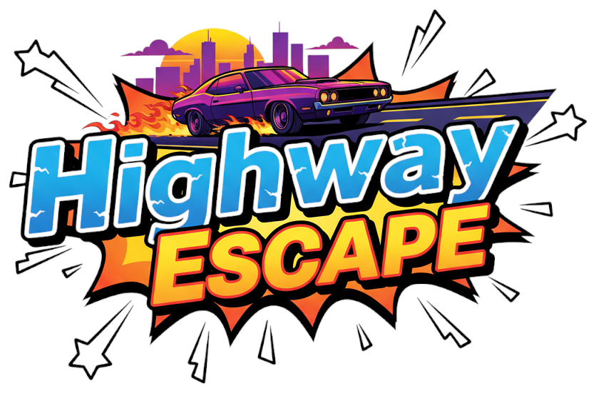

# Highway Escape

Highway Escape é um jogo arcade em 2D desenvolvido utilizando Python e PgZero.

Escolha seu carro preferido e atravesse a highway o mais rápido que conseguir!


## ⭐ Detalhes

- Várias pistas de carros aleatórios com velocidades diferentes.
- Sistema de vidas (representado por rodas).
- Animações de colisão com efeito de knockback.
- Sons de motor e colisões.
- Música de fundo.
- Seleção de veículo em carrossel.
- Pausa e tela de Game Over.

---

## 🎮 Como Jogar

- **Menu e seleção de veículo:**
  - `ENTER` → Selecionar opções / Confirmar
  - `ESC` → Voltar / Sair
  - `M` → Ativar / Desativar som
  
- **Teclas de controle do carro:**
  - `SETAS CIMA/BAIXO` → Acelerar / Frear
  - `SETAS ESQUERDA/DIREITA` → Virar o carro
  
**Evite colisões!** Cada colisão diminui suas vidas. O jogo termina quando todas as vidas acabam.

**Vidas iniciais:** ❤️❤️❤️❤️❤️

---

## 💻 Requisitos

- Python 3.10 ou superior

---

## ⚙️ Instalação

### 1. Clone o repositório:

```bash
git clone https://github.com/FilipeOVB/highway-escape-game.git
cd ./highway-escape-game
```

### 2. Utilize um ambiente virtual (Opicional):

Para que evitar problemas entre dependências e versões é recomendável utilizar um ambiente virtual `venv` para testar e realizar alterações.

- #### Crie o ambiente virtual (venv):

    - ```bash
        python -m venv venv
        ```
- #### Ative o ambiente:
  
  - Linux / macOS:
  
    ```bash
    source venv/bin/activate
    ```
  - Windows:

    ```bash
    venv\Scripts\activate
    ```

### 3. Execute o Jogo:

    ```bash
    python main.py
    ```

---

## 🔊 Sons e Música

- **Música de fundo:** loop contínuo.
- **Sons de colisão:** são executados sempre que ocorre um crash.
- **Sons do motor:** variam de acordo com a velocidade do carro.

---

## 📦 Criando Executável (Opcional)

É posível criar um executável utilizando `PyInstaller`:

**Nota:** Podem ocorrer alguns problemas ao tentar criar o arquivo executável a partir de um ambiente virtual `venv` se você realmente deseja criar o executável é necessário sair do ambiente virtual executando `deactivate` e então fora do ambiente, instale todas as dependências novamente de forma global em seu sistema.

- Linux / macOS:
    No mesmo diretório do projeto, execute:

    ```bash
    pyinstaller --noconfirm --clean --onefile --windowed --collect-all pgzero --collect-all pygame --add-data "images:images" --add-data "sounds:sounds"  --add-data "music:music" main.py
    ```

Foram cridas algumas pastas, o arquivo executável `main`será gerado na pasta `dist/`.

Para Windows o método é parecido porém não foi testado e por isso não será divulgado aqui.

---
## 📝 Licença

- **MIT License**